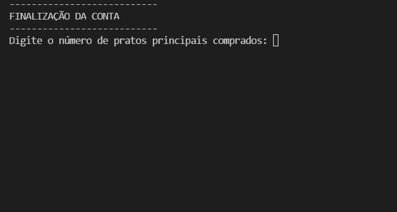

# cupom-de-desconto
Programa para aplicação de descontos progressivos para um restaurante.

O usuário foi pensado para ser um funcionário da empresa (caixa), que faz a validação das informações no fechamento da conta.

No caso, os descontos são aplicados na conta do cliente de acordo com o cumprimento de algumas regras:
- Se o cliente comprou mais do que 3 pratos, recebe 4% de desconto.
- Se o valor total da conta ultrapassar R$500, cliente recebe 6% de desconto.
- Se possuir algum cupom de desconto extra, deve informar o nome do cupom.
- Caso seja a primeira visita do cliente no restaurante, ganha 5% de desconto. 

E no final, a nota sai com o número total de pessoas que frequentou a mesa pois assim possibilita os clientes "racharem" a conta, caso queiram. 

